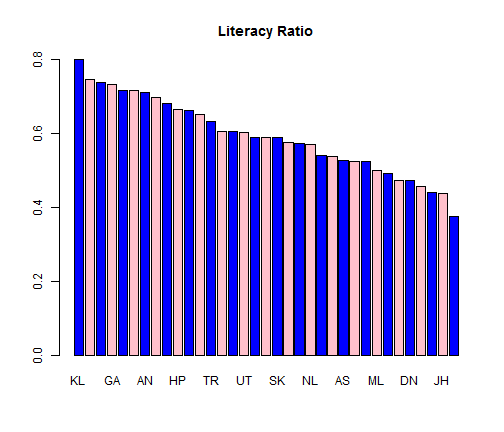
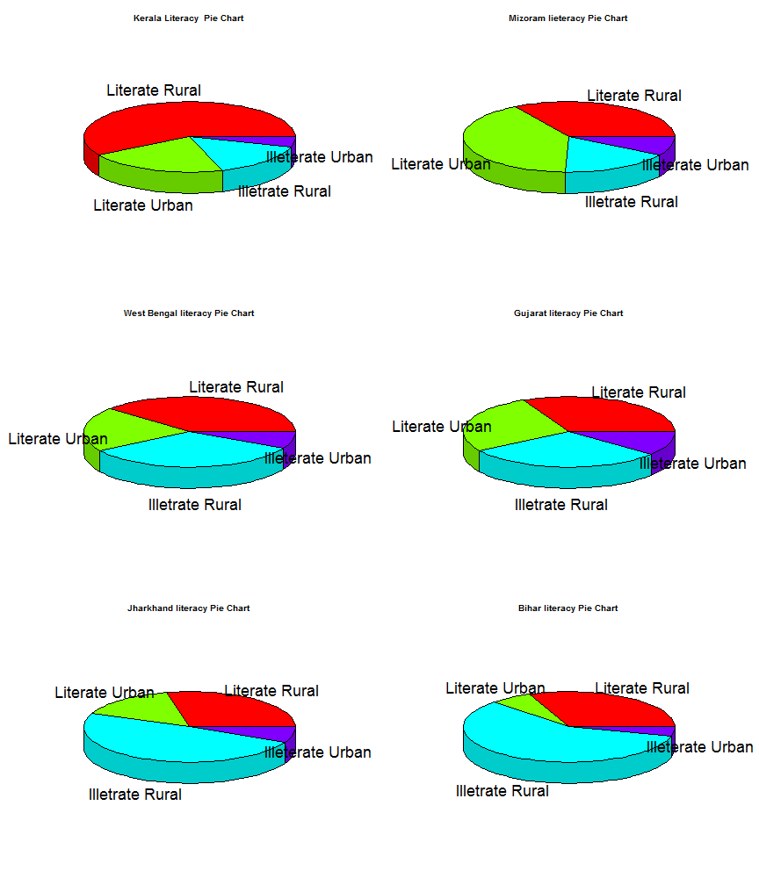
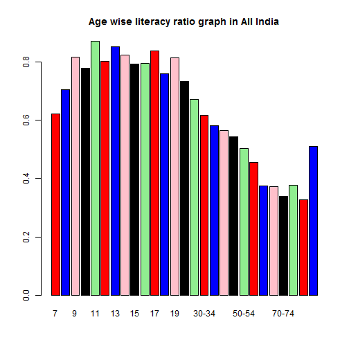
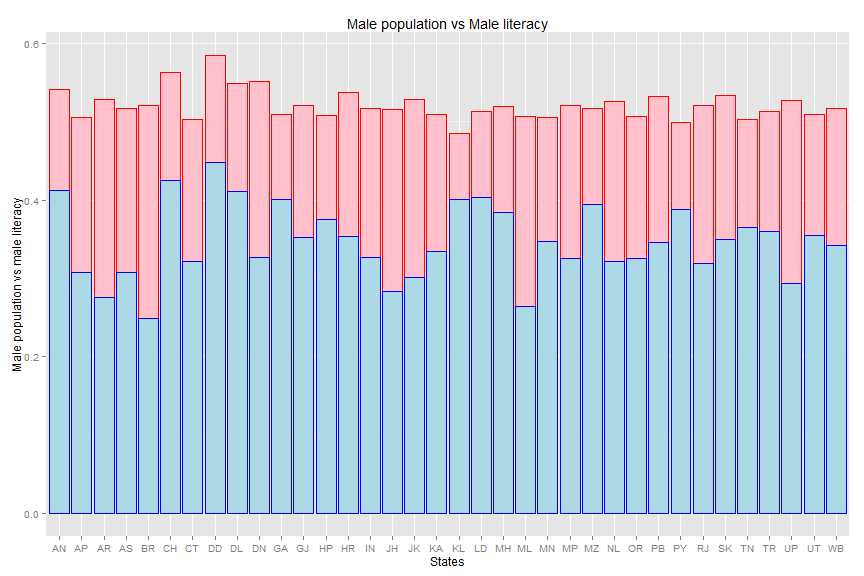
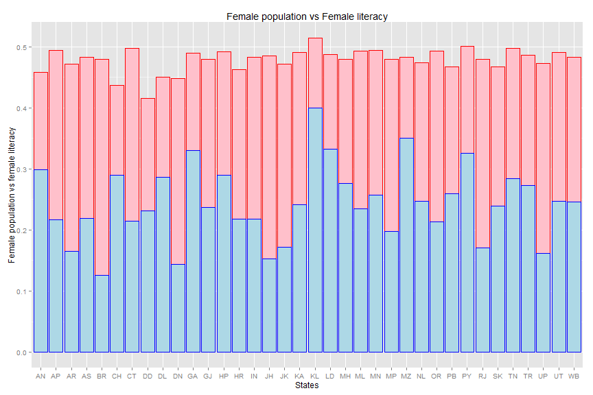
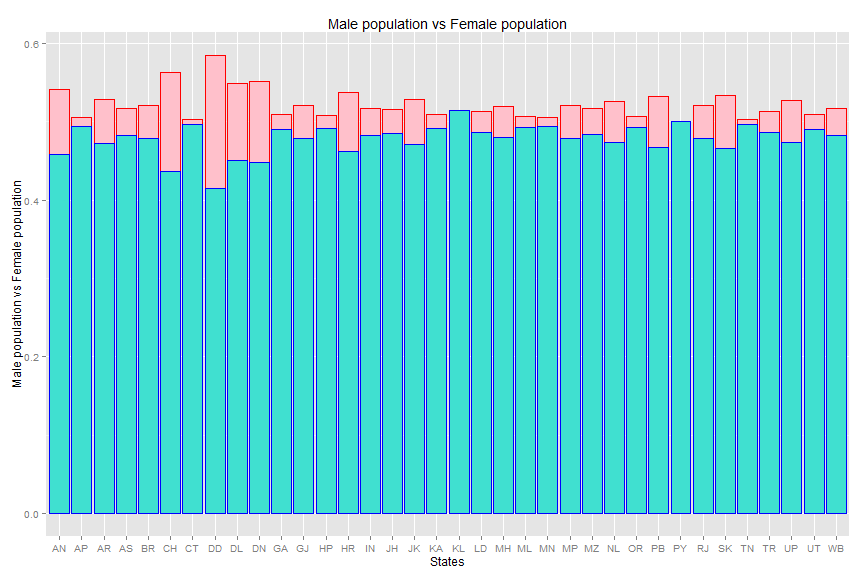
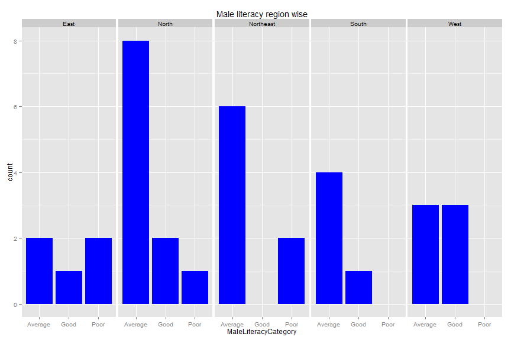
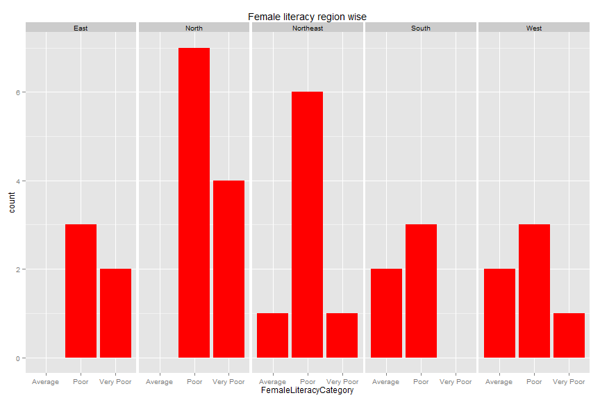

Shikshya Abhiyan (Mission Education)
========================================================

Education is the key to unlock the golden door of freedom.

For the final project I am planning to work on analyzing literacy data for all the states in India. The data for literacy in different states of India is obtained from http://data.gov.in/ . The data will help Shiksha Abhiyan (Mission Education), a charitable organization which will focus on emphasizing the education mostly for the primary level. They are planning to spread the word that primary education is the right for all. My analysis will analyze the data which state is doing well in growing the literacy rate and which state is failing to do so. The data will also analyze to help the literacy rate age wise and will try to identify if there is any drastic drop of percentage of students going to school from one age level to another age level. This will help Shiksha Abhiyan to take decision where and how to focus on their mission. They may try to find out the model from the growing state how they are growing literacy in the state. More interestingly they are trying to find out the student ratio gender wise. My analysis will find out if significantly lesser number of girl children are attending in particular area. They will focus that how education will help the society to advance irrespective of boy or girl. They will try to convince the parents to send their kids to school. Both the brothers and sisters from the same house should get the chance to study.

The raw data is uploaded in Github at:

<b>Selecting the required data into a dataframe, data transformation and cleaning </b>


```r
require(dplyr)
```

```
## Loading required package: dplyr
```

```
## Warning: package 'dplyr' was built under R version 3.1.2
```

```
## 
## Attaching package: 'dplyr'
## 
## The following object is masked from 'package:stats':
## 
##     filter
## 
## The following objects are masked from 'package:base':
## 
##     intersect, setdiff, setequal, union
```

```r
library(plotrix)
```

```
## Warning: package 'plotrix' was built under R version 3.1.2
```

```r
require(ggplot2)
```

```
## Loading required package: ggplot2
```

```
## Warning: package 'ggplot2' was built under R version 3.1.1
```

```r
require(reshape2)
```

```
## Loading required package: reshape2
```

```r
require(RPostgreSQL)
```

```
## Loading required package: RPostgreSQL
```

```
## Warning: package 'RPostgreSQL' was built under R version 3.1.2
```

```
## Loading required package: DBI
```

```
## Warning: package 'DBI' was built under R version 3.1.2
```

```r
postgresdb<-"postgres"
postgresUsername<-"postgres"
postgresPassword<-"password"

IndiaEducationDf<- read.csv(file.choose(), header=TRUE)

#Function to clean the Area.Name and outputs the area name
cleanStates<-function(input){
  output=c()
  for(val in input){
    if(val!="INDIA"){
      output=c(output,substr(val, 9, nchar(val)-4))
    }
    else
      output=c(output,"INDIA")
  }
  return(output)
}

  

getStateCode<-function(input){
  stateCode_vec<-c()
  region_vec<-c()
  drv <- dbDriver("PostgreSQL")
  con <- dbConnect(drv, dbname=postgresdb, postgresUsername, password=postgresPassword)
  stateLookup <-dbReadTable(con,"india_state_code")

  for(val in input){
      stateCode<-filter(stateLookup, name==val) %>%
        select(code) 
      region<-filter(stateLookup, name==val) %>%
        select(region) 
        
      stateCode_vec=c(stateCode_vec,stateCode)
      region_vec=c(region_vec,region)
      
    }
  ## Closes the connection
dbDisconnect(con)

## Frees all the resources on the driver
dbUnloadDriver(drv)
output<-list("stateCode_vec"=stateCode_vec, "region_vec"=region_vec)
}  

literacy_data<-filter(IndiaEducationDf, Age.group=="All ages")%>%
  select(Area.Name:Literate...Females)
literacy_data$Area.Name<-cleanStates(literacy_data$Area.Name)
literacy_data<-cbind(StateCode = "", literacy_data)
literacy_data<-cbind(Region = "", literacy_data)
outputList<-getStateCode(literacy_data$Area.Name)
literacy_data$StateCode = unlist(outputList$stateCode_vec)
literacy_data$Region = unlist(outputList$region_vec)
```
<h3> Literacy data analysis in the states of India</h3>

```r
literacy_ratio<-filter(literacy_data, Total..Rural..Urban=="Total" )%>%
  select(StateCode, Area.Name, Total...Persons, Literate...Persons ) %>%
  mutate(Ratio=Literate...Persons/Total...Persons) %>%
  arrange(desc(Ratio))

show(literacy_ratio)
```

```
##    StateCode                 Area.Name Total...Persons Literate...Persons
## 1         KL                    KERALA        31841374           25485688
## 2         MZ                   MIZORAM          888573             661445
## 3         LD               LAKSHADWEEP           60650              44683
## 4         GA                       GOA         1347668             985562
## 5         PY               PONDICHERRY          974345             696367
## 6         CH                CHANDIGARH          900635             643245
## 7         AN ANDAMAN & NICOBAR ISLANDS          356152             253135
## 8         DL                     DELHI        13850507            9664764
## 9         DD               DAMAN & DIU          158204             107600
## 10        HP          HIMACHAL PRADESH         6077900            4041621
## 11        MH               MAHARASHTRA        96878627           63965943
## 12        TN                TAMIL NADU        62405679           40524545
## 13        TR                   TRIPURA         3199203            2022099
## 14        PB                    PUNJAB        24358999           14756970
## 15        MN                   MANIPUR         2166788            1310534
## 16        UT               UTTARANCHAL         8489349            5105782
## 17        WB               WEST BENGAL        80176197           47196401
## 18        GJ                   GUJARAT        50671017           29827750
## 19        SK                    SIKKIM          540851             318335
## 20        KA                 KARNATAKA        52850562           30434962
## 21        HR                   HARYANA        21144564           12093677
## 22        NL                  NAGALAND         1990036            1132323
## 23        IN                     INDIA      1028610328          560687797
## 24        OR                    ORISSA        36804660           19837055
## 25        CT              CHHATTISGARH        20833803           11173149
## 26        AS                     ASSAM        26655528           14015354
## 27        AP            ANDHRA PRADESH        76210007           39934323
## 28        MP            MADHYA PRADESH        60348023           31592563
## 29        ML                 MEGHALAYA         2318822            1157875
## 30        RJ                 RAJASTHAN        56507188           27702010
## 31        JK           JAMMU & KASHMIR        10143700            4807286
## 32        DN      DADRA & NAGAR HAVELI          220490             103904
## 33        UP             UTTAR PRADESH       166197921           75719284
## 34        AR         ARUNACHAL PRADESH         1097968             484785
## 35        JH                 JHARKHAND        26945829           11777201
## 36        BR                     BIHAR        82998509           31109577
##     Ratio
## 1  0.8004
## 2  0.7444
## 3  0.7367
## 4  0.7313
## 5  0.7147
## 6  0.7142
## 7  0.7107
## 8  0.6978
## 9  0.6801
## 10 0.6650
## 11 0.6603
## 12 0.6494
## 13 0.6321
## 14 0.6058
## 15 0.6048
## 16 0.6014
## 17 0.5887
## 18 0.5887
## 19 0.5886
## 20 0.5759
## 21 0.5720
## 22 0.5690
## 23 0.5451
## 24 0.5390
## 25 0.5363
## 26 0.5258
## 27 0.5240
## 28 0.5235
## 29 0.4993
## 30 0.4902
## 31 0.4739
## 32 0.4712
## 33 0.4556
## 34 0.4415
## 35 0.4371
## 36 0.3748
```

```r
l_ratio<-as.vector(as.matrix(filter(literacy_ratio, Area.Name!="INDIA")%>%
  select(Ratio)))
states<-as.vector(as.matrix(filter(literacy_ratio, Area.Name!="INDIA") %>%
  select(Area.Name)))
stateCodes<-as.vector(as.matrix(filter(literacy_ratio, Area.Name!="INDIA") %>%
  select(StateCode)))
```


```r
barplot(l_ratio, main="Literacy Ratio", 
    names.arg=stateCodes, col=c("blue","pink"))
```

 
Note: Please refer the state index below for the above plot

```r
show(states)
```

```
##  [1] "KERALA"                    "MIZORAM"                  
##  [3] "LAKSHADWEEP"               "GOA"                      
##  [5] "PONDICHERRY"               "CHANDIGARH"               
##  [7] "ANDAMAN & NICOBAR ISLANDS" "DELHI"                    
##  [9] "DAMAN & DIU"               "HIMACHAL PRADESH"         
## [11] "MAHARASHTRA"               "TAMIL NADU"               
## [13] "TRIPURA"                   "PUNJAB"                   
## [15] "MANIPUR"                   "UTTARANCHAL"              
## [17] "WEST BENGAL"               "GUJARAT"                  
## [19] "SIKKIM"                    "KARNATAKA"                
## [21] "HARYANA"                   "NAGALAND"                 
## [23] "ORISSA"                    "CHHATTISGARH"             
## [25] "ASSAM"                     "ANDHRA PRADESH"           
## [27] "MADHYA PRADESH"            "MEGHALAYA"                
## [29] "RAJASTHAN"                 "JAMMU & KASHMIR"          
## [31] "DADRA & NAGAR HAVELI"      "UTTAR PRADESH"            
## [33] "ARUNACHAL PRADESH"         "JHARKHAND"                
## [35] "BIHAR"
```

<b> The literacy ratio for the top two performing states</b>

```r
Kerala_literacy_ratio<-filter(literacy_data, Area.Name=="KERALA")%>%
  select(Total..Rural..Urban, Total...Persons, Literate...Persons,Illiterate...Persons ) %>%
  mutate(LiteracyRatio=Literate...Persons/Total...Persons) 
show(Kerala_literacy_ratio)
```

```
##   Total..Rural..Urban Total...Persons Literate...Persons
## 1               Total        31841374           25485688
## 2               Rural        23574449           18653369
## 3               Urban         8266925            6832319
##   Illiterate...Persons LiteracyRatio
## 1              6355686        0.8004
## 2              4921080        0.7913
## 3              1434606        0.8265
```

```r
data1<-as.vector(as.matrix(filter(Kerala_literacy_ratio, Total..Rural..Urban!="Total")%>%
  select(Literate...Persons, Illiterate...Persons)))

lbls<-c("Literate Rural", "Literate Urban", "Illetrate Rural", "Illeterate Urban")


Mizoram_literacy_ratio<-filter(literacy_data, Area.Name=="MIZORAM")%>%
  select(Total..Rural..Urban, Total...Persons, Literate...Persons, Illiterate...Persons ) %>%
  mutate(LiteracyRatio=Literate...Persons/Total...Persons) 
show(Mizoram_literacy_ratio)
```

```
##   Total..Rural..Urban Total...Persons Literate...Persons
## 1               Total          888573             661445
## 2               Rural          447567             298339
## 3               Urban          441006             363106
##   Illiterate...Persons LiteracyRatio
## 1               227128        0.7444
## 2               149228        0.6666
## 3                77900        0.8234
```

```r
data2<-as.vector(as.matrix(filter(Mizoram_literacy_ratio, Total..Rural..Urban!="Total")%>%
  select(Literate...Persons, Illiterate...Persons)))
```

From the data we can see that the Urban and Rural data are comparable in Kerala. But there is significant difference in the literacy ratio in the Urban and Rural Area in Mizoram.

<b> The literacy ratio for the average two performing states</b>


```r
WestBengal_literacy_ratio<-filter(literacy_data, Area.Name=="WEST BENGAL")%>%
  select(Total..Rural..Urban, Total...Persons, Literate...Persons, Illiterate...Persons ) %>%
  mutate(LiteracyRatio=Literate...Persons/Total...Persons) 
show(WestBengal_literacy_ratio)
```

```
##   Total..Rural..Urban Total...Persons Literate...Persons
## 1               Total        80176197           47196401
## 2               Rural        57748946           30840027
## 3               Urban        22427251           16356374
##   Illiterate...Persons LiteracyRatio
## 1             32979796        0.5887
## 2             26908919        0.5340
## 3              6070877        0.7293
```

```r
data3<-as.vector(as.matrix(filter(WestBengal_literacy_ratio, Total..Rural..Urban!="Total")%>%
  select(Literate...Persons, Illiterate...Persons)))


Gujarat_literacy_ratio<-filter(literacy_data, Area.Name=="GUJARAT")%>%
  select(Total..Rural..Urban, Total...Persons, Literate...Persons, Illiterate...Persons ) %>%
  mutate(LiteracyRatio=Literate...Persons/Total...Persons) 
show(Gujarat_literacy_ratio)
```

```
##   Total..Rural..Urban Total...Persons Literate...Persons
## 1               Total        50671017           29827750
## 2               Rural        31740767           16337997
## 3               Urban        18930250           13489753
##   Illiterate...Persons LiteracyRatio
## 1             20843267        0.5887
## 2             15402770        0.5147
## 3              5440497        0.7126
```

```r
data4<-as.vector(as.matrix(filter(Gujarat_literacy_ratio, Total..Rural..Urban!="Total")%>%
  select(Literate...Persons, Illiterate...Persons)))
```
Both West Bengal and Gujarat needs to focus on the Rural part. Note that the population of the Rural part of West Bengal is much higher.

<b> The literacy ratio for the least two performing states</b>


```r
Jharkhand_literacy_ratio<-filter(literacy_data, Area.Name=="JHARKHAND")%>%
  select(Total..Rural..Urban, Total...Persons, Literate...Persons, Illiterate...Persons ) %>%
  mutate(LiteracyRatio=Literate...Persons/Total...Persons)
show(Jharkhand_literacy_ratio)
```

```
##   Total..Rural..Urban Total...Persons Literate...Persons
## 1               Total        26945829           11777201
## 2               Rural        20952088            7703730
## 3               Urban         5993741            4073471
##   Illiterate...Persons LiteracyRatio
## 1             15168628        0.4371
## 2             13248358        0.3677
## 3              1920270        0.6796
```

```r
data5<-as.vector(as.matrix(filter(Jharkhand_literacy_ratio, Total..Rural..Urban!="Total")%>%
  select(Literate...Persons, Illiterate...Persons)))


Bihar_literacy_ratio<-filter(literacy_data, Area.Name=="BIHAR")%>%
  select(Total..Rural..Urban, Total...Persons, Literate...Persons, Illiterate...Persons ) %>%
  mutate(LiteracyRatio=Literate...Persons/Total...Persons)
show(Bihar_literacy_ratio)
```

```
##   Total..Rural..Urban Total...Persons Literate...Persons
## 1               Total        82998509           31109577
## 2               Rural        74316709           25876919
## 3               Urban         8681800            5232658
##   Illiterate...Persons LiteracyRatio
## 1             51888932        0.3748
## 2             48439790        0.3482
## 3              3449142        0.6027
```

```r
data6<-as.vector(as.matrix(filter(Bihar_literacy_ratio, Total..Rural..Urban!="Total")%>%
  select(Literate...Persons, Illiterate...Persons)))
```
Jarkhand and Bihar seriously need to focus on the Rural part. Moreover the ratio of Urban part of Bihar is relatively lower than the other states.


```r
par(mfrow=c(3,2))
pie3D(data1, labels = lbls, main="Kerala Literacy  Pie Chart")
pie3D(data2, labels = lbls, main="Mizoram lieteracy Pie Chart")
pie3D(data3, labels = lbls, main="West Bengal literacy Pie Chart")
pie3D(data4, labels = lbls, main="Gujarat literacy Pie Chart")
pie3D(data5, labels = lbls, main="Jharkhand literacy Pie Chart")
pie3D(data6, labels = lbls, main="Bihar literacy Pie Chart")
```

 
<h3>Lieteracy data analysis agewise in the states of India</h3>

```r
literacyDataByAge<-filter(IndiaEducationDf, Total..Rural..Urban=="Total" & Age.group!="All ages" & Age.group!="0-6") %>%
  select(Age.group, Area.Name, Total...Persons, Literate...Persons) %>%
  mutate(LiteracyRatio=Literate...Persons/Total...Persons)
literacyDataByAge$Area.Name = cleanStates(literacyDataByAge$Area.Name)

IndiaRatiobyAge<-filter(literacyDataByAge, Area.Name=="INDIA")%>%
  select(Age.group, LiteracyRatio)

Age.group<-IndiaRatiobyAge$Age.group
LiteracyRatio<-IndiaRatiobyAge$LiteracyRatio
```
From the data provided above, we can see that in general there is percentage rise of literacy ratio with age. There may be certain criteria to mark a person as literate.

```r
barplot(LiteracyRatio,  main="Age wise literacy ratio graph in All India", 
names.arg=Age.group, col=c("red","blue","pink","black","light green"))
```

 

<h3>Lieteracy data analysis genderwise</h3>

```r
literacyDataByGender<-filter(literacy_data, Total..Rural..Urban=="Total" & Age.group=="All ages") %>%
  select( StateCode, Area.Name, Total...Persons:Literate...Females) %>%
  mutate(MalePopRatio=Total...Males/Total...Persons, FemalePopRatio=Total...Females/Total...Persons, LiteracyRatioMale=Literate...Males/Total...Persons, LiteracyRatioFemale=Literate...Females/Total...Persons, LiterateMaleRatiWithin=Literate...Males/Total...Males, LiterateFemaleRatiWithin=Literate...Females/Total...Females)
```

<u>Comparison of literacy ratio genderwise</u>

```r
ggplot( data=literacyDataByGender, aes(x=StateCode , y=MalePopRatio)) + 
  geom_bar(stat="identity", fill="pink", colour="red")+
  geom_bar(data=literacyDataByGender, aes(x=StateCode, y=LiteracyRatioMale),
           stat="identity", fill="light blue", colour="blue")+ggtitle("Male population vs Male literacy")+
     xlab("States")+ ylab("Male population vs male literacy")
```

 


```r
ggplot(main="Female population vs Female literacy", data=literacyDataByGender, aes(x=StateCode, y=FemalePopRatio), xlab("States"), ylab("Female population vs female literacy")) + 
  geom_bar(stat="identity", fill="pink", colour="red")+
  geom_bar(data=literacyDataByGender, aes(x=StateCode, y=LiteracyRatioFemale),
           stat="identity", fill="light blue", colour="blue")+ggtitle("Female population vs Female literacy")+
     xlab("States")+ ylab("Female population vs female literacy")
```

 
</br>
From the plots above we can see that the female average female population is lesser than average male population. Overall male literacy is also better than the female literacy rate.
Kerala is againg showing very good result in terms of female population and female literacy.

<u>Comparison of Male and Female population in the states of India</u>


```r
ggplot( data=literacyDataByGender, aes(x=StateCode , y=MalePopRatio)) + 
  geom_bar(stat="identity", fill="pink", colour="red")+
  geom_bar(data=literacyDataByGender, aes(x=StateCode, y=FemalePopRatio),
           stat="identity", fill="turquoise", colour="blue")+ggtitle("Male population vs Female population")+
     xlab("States")+ ylab("Male population vs Female population")
```

 
There is very concerning population ratio difference between male and female in DADRA & NAGAR HAVELI, DAMAN & DIU, and DELHI.
Again Keral is exemplary. Kerala is the bright spot in our analysis and we need to find out how Kerala is doing different from the rest of the country.

<u>Genderwise literacy analysis in the regions of India</u>

```r
genderLiteracyRatio<-filter(literacy_data, Total..Rural..Urban=="Total" & Age.group=="All ages" & StateCode!="IN") %>%
  select(Region, Total...Persons,Literate...Males, Literate...Females) %>%
mutate(FemaleLiteracyRatio=(Literate...Females/Total...Persons), MaleLiteracyRatio=(Literate...Males/Total...Persons))

genderLiteracyRatio$FemaleLiteracyCategory[genderLiteracyRatio$FemaleLiteracyRatio<=0.2]<-"Very Poor"
genderLiteracyRatio$FemaleLiteracyCategory[genderLiteracyRatio$FemaleLiteracyRatio<=0.3 & genderLiteracyRatio$FemaleLiteracyRatio>0.2]<-"Poor"
genderLiteracyRatio$FemaleLiteracyCategory[genderLiteracyRatio$FemaleLiteracyRatio<=0.4 & genderLiteracyRatio$FemaleLiteracyRatio>0.3]<-"Average"
genderLiteracyRatio$FemaleLiteracyCategory[genderLiteracyRatio$FemaleLiteracyRatio<=0.5 & genderLiteracyRatio$FemaleLiteracyRatio>0.4]<-"Good"
genderLiteracyRatio$FemaleLiteracyCategory[genderLiteracyRatio$FemaleLiteracyRatio<=0.6 & genderLiteracyRatio$FemaleLiteracyRatio>0.5]<-"Vey Good"
genderLiteracyRatio$FemaleLiteracyCategory[genderLiteracyRatio$FemaleLiteracyRatio>0.6]<-"Considerable"

genderLiteracyRatio$MaleLiteracyCategory[genderLiteracyRatio$MaleLiteracyRatio<=0.2]<-"Very Poor"
genderLiteracyRatio$MaleLiteracyCategory[genderLiteracyRatio$MaleLiteracyRatio<=0.3 & genderLiteracyRatio$MaleLiteracyRatio>0.2]<-"Poor"
genderLiteracyRatio$MaleLiteracyCategory[genderLiteracyRatio$MaleLiteracyRatio<=0.4 & genderLiteracyRatio$MaleLiteracyRatio>0.3]<-"Average"
genderLiteracyRatio$MaleLiteracyCategory[genderLiteracyRatio$MaleLiteracyRatio<=0.5 & genderLiteracyRatio$MaleLiteracyRatio>0.4]<-"Good"
genderLiteracyRatio$MaleLiteracyCategory[genderLiteracyRatio$MaleLiteracyRatio<=0.6 & genderLiteracyRatio$MaleLiteracyRatio>0.5]<-"Vey Good"
genderLiteracyRatio$MaleLiteracyCategory[genderLiteracyRatio$MaleLiteracyRatio>0.6]<-"Considerable"
```


```r
p <- ggplot(genderLiteracyRatio, aes(MaleLiteracyCategory)) +
        geom_histogram(binwidth = 1, fill="blue")+ggtitle("Male literacy region wise")
p + facet_grid(. ~ Region)
```

 

```r
p <- ggplot(genderLiteracyRatio, aes(FemaleLiteracyCategory)) +
        geom_histogram(binwidth = 1, fill="red")+ggtitle("Female literacy region wise")
p + facet_grid(. ~ Region)
```

 
<h3>Conclusion</h3>
From the analysis done above, we have noticed that Kerala is always excelling in case of literacy or regarding to equal gender ratio. Here Kerala is the bright spot. 
In general though there is a tendency in the Urban areas people attending schools but in Rural need to improve a lot.
Jharakhand and Bihar are lagging behind literacy. We need to seriously focus on a bunch of states for female literacy like Jharkhand, Bihar, Jammu and Kashmir, Uttar Pradesh and Rajasthan. Spreading awareness like how important is education in all our lives and how it will help the scoiety to improve if both girls and boys are educated.
Serious concern in the ratio difference boys and girls. Eve oveall in India, the ratio difference is alarming. We need to sperad awarenes and need to take serious steps if any kind of bad malpratices are happening with girls.
